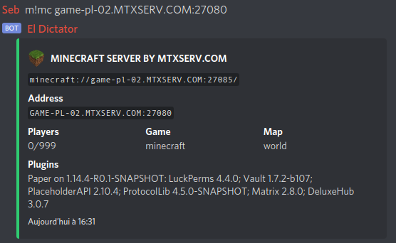

# mTxServ Official Discord Bot

This bot is developed with `discord.js` and `discord commando`.





## Available commands in this DM

### Main
* `explain`: Display explain message
* `forkme`: Contribute to this bot!
* `help`: Displays a list of available commands, or detailed information for a specified command.
* `invite`: Get invitation link to join mTxServ discord
* `rules`: Get rules of this Discord
* `social`: Show social links
* `stock`: Get Stock of mTxServ
* `support`: Get support informations

### News
* `hytale`: Show latest blog posts from Hytale official website (EN).
* `hytalefr`: Show latest blog posts from [minecraft.fr](https://minecraft.fr) website (FR).
* `minecraftfr`: Show latest blog posts from [hytale](https://hytale.game) website (FR).

### How-To
* `howto`: Search a tutorial.

### Partner
* `numerix`: Show who is Numerix
* `partners`: Show partners

### GMod Server
* `darkrp`: Search in DarkRP official wiki
* `glua`: Search in GMod official wiki

### Minecraft Server
* `bukkit`: Show Bukkit infos + latest version.
* `fabric`: Show Fabric infos + latest version.
* `forge`: Show Forge infos + latest version.
* `magma`: Show Magma infos + latest version.
* `mohist`: Show Mohist infos + latest version.
* `paper`: Show Paper infos + latest version.
* `snapshot`: Show Minecraft Snapshot infos + latest version.
* `spigot`: Show Spigot infos + latest version.
* `vanilla`: Show Minecraft Vanilla infos + latest version.

### Game Server
* `version`: Search a minecraft version or modpack.

### Game Server Status
* `ark`: Check if a ARK game server is online or offline.
* `gmod`: Check if a GMod game server is online or offline.
* `minecraft`: Check if a Minecraft game server is online or offline.
* `rust`: Check if a Rust game server is online or offline.
* `status`: Check if a game server is online or offline.

## Installation

```
docker-compose build
docker-compose up -d
docker-compose exec bot bash
yarn install
cp .env.dist .env
```

## Configuration

Copy the `.env.dist` to `.env`. Don't forget to edit it.

```
cp .env.dist .env
```

## Dev

If the `dev` flag, the `BOT_TOKEN_DEV` will be used tu run the bot:

```
nodejs bot.js -dev
```

## Prod

```
nodejs bot.js
```
