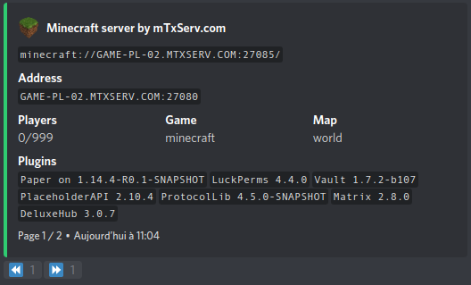
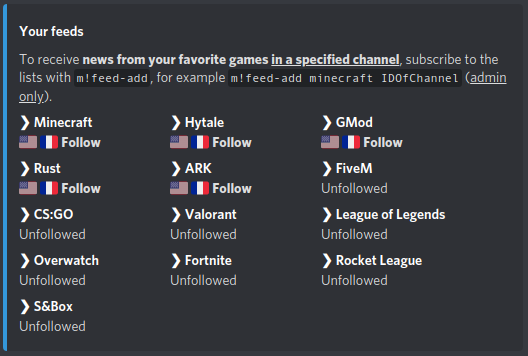
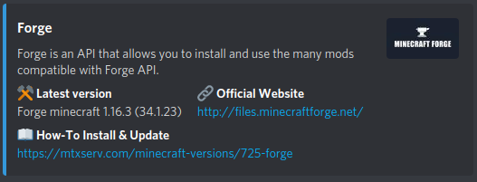
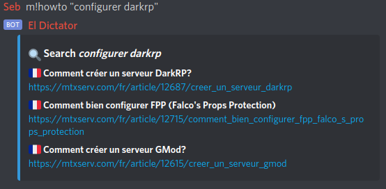
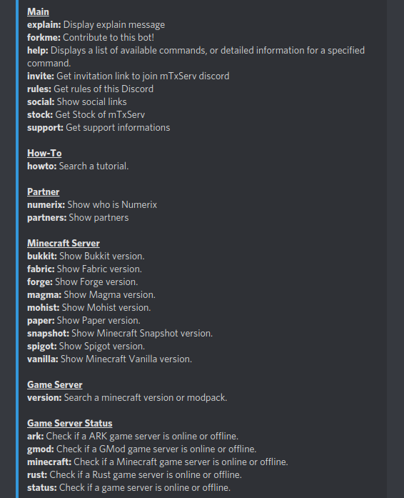

  

# El Dictator Bot
[](https://discord.gg/hQNpp7c)

El Dictator is the official bot of [mTxServ.com](https://mtxserv.com), he contain a lot of commands to help you to manage your game servers (minecraft, ark, gmod, rust, fivem, etc) and your vps.

You can invite the bot in your own discord server with this [link](https://discord.com/oauth2/authorize?client_id=535435520394657794&permissions=604892353&scope=bot).

Main features:
* create your gameservers list on discord for your members
* auto-post of games news
* link your account with mTxServ
* Show & search in minecraft server versions and modpacks
* Search how-to in vps ou gameservers sections
* Search in officials gmod & darkrp wiki
* Search map and addon in the STEAM Workshop
* Multi-languages (fr/en)

This bot was created with `discord.js` and `discord commando`.


## Table of Contents

- [Copyright](#copyright)
- [Invite](#invite)
- [Screenshots](#screenshots)
- [Permissions](#permissions)
- [Commands](#commands)
- [Installation](#installation)
- [Configuration](#configuration)

## Copyright

- ©2020 mTxServ\`Seb#7508
- mTxServ.com

## Invite

- [Home Server](https://discord.gg/hQNpp7c)
- [Invite](https://discord.com/oauth2/authorize?client_id=535435520394657794&permissions=604892353&scope=bot)

## Screenshots





## Permissions

El Dictator needs several permissions to be able to do what she does.

- **Create Instant Invite**
- **View Audit Log**
- **Change Nickname**
- **View Channels**
- **Send Messages**
- **Manage Messages**
- **Embed Links**
- **Attach Files**
- **Read Message History**
- **Use External Emojis**
- **Add Reactions**

## Commands



### Main
* `explain`: Display explain message
* `forkme`: Contribute to this bot!
* `help`: Displays a list of available commands, or detailed information for a specified command.
* `invite`: Get invitation link to join mTxServ discord
* `rules`: Get rules of this Discord
* `social`: Show social links
* `stock`: Get Stock of mTxServ
* `support`: Get support informations

### Bot
* `bot-status`: Display bot status.
* `forkme`: Contribute to this bot !

### News
* `hytale`: Show latest blog posts from Hytale official website (EN).
* `hytalefr`: Show latest blog posts from [hytale](https://hytale.game) website (FR).
* `minecraftfr`: Show latest blog posts from [minecraft.fr](https://minecraft.fr) website (FR).
* `gmod-news` : Show latest blog posts from [gmod](https://gmod.facepunch.com) website (FR).
* `rust-news` : Show latest blog posts from [rust](https://rust.facepunch.com) website (FR).
* `sandbox` : Show latest blog posts from [sandbox](https://sandbox.facepunch.com) website (FR).

### How-To
* `howto`: Search a tutorial.

### Partner
* `numerix`: Show who is Numerix
* `partners`: Show partners

### GMod Server
* `darkrp`: Search in DarkRP official wiki
* `glua`: Search in GMod official wiki
* `workshop`: Search in STEAM workshop

### Minecraft Server
* `bukkit`: Show Bukkit infos + latest version.
* `fabric`: Show Fabric infos + latest version.
* `forge`: Show Forge infos + latest version.
* `magma`: Show Magma infos + latest version.
* `mohist`: Show Mohist infos + latest version.
* `paper`: Show Paper infos + latest version.
* `snapshot`: Show Minecraft Snapshot infos + latest version.
* `spigot`: Show Spigot infos + latest version.
* `vanilla`: Show Minecraft Vanilla infos + latest version.

### Game Server
* `version`: Search a minecraft version or modpack.

### Game Server Status
* `ark`: Check if a ARK game server is online or offline.
* `gmod`: Check if a GMod game server is online or offline.
* `minecraft`: Check if a Minecraft game server is online or offline.
* `rust`: Check if a Rust game server is online or offline.
* `status`: Check if a game server is online or offline.

### Image
* `cover-ark`: Generate a ARK cover.
* `cover-gmod`: Generate a GMod cover.
* `cover-hytale`: Generate a Hytale cover.
* `cover-minecraft`: Generate a Minecraft cover.
* `cover-onset`: Generate a Onset cover.
* `cover-rust`: Generate a Rust cover.
* `cover-vps`: Generate a VPS cover.
* `cover`: Generate a cover image.

### Random
* `cat`: Responds with a random cat image.
* `dog`: Responds with a random dog image.

## Installation

```
docker-compose build
docker-compose up -d
docker-compose exec bot bash
yarn install
cp .env.dist .env
```

## Configuration

Copy the `.env.dist` to `.env`. Don't forget to edit it.

```
cp .env.dist .env
```

### Dev

If the `dev` flag, the `BOT_TOKEN_DEV` will be used tu run the bot:

```
nodejs bot.js -dev
```

### Prod

```
nodejs bot.js
```

### Lint

```
yarn run eslint . --ignore-path .gitignore
```
